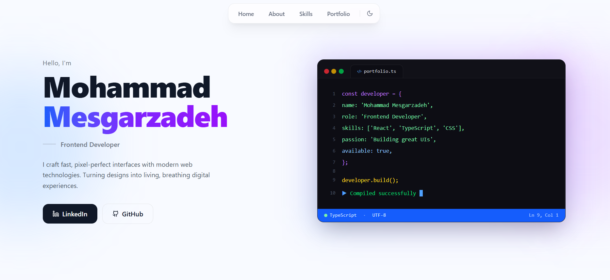

# Mohammad Mesgarzadeh Portfolio

Welcome to my personal portfolio website. This project showcases my front-end development skills, featured projects, and technical expertise.

## Tech Stack

- React
- TypeScript
- Tailwind CSS
- Vite

## Highlights

- Fully Responsive Design
- Accessibility Focused
- Modern UI/UX
- Performance Optimized
- Reusable Components
- Clean Code Architecture

## Live Website

🔗 [Visit Portfolio](https://mohammad-mesgarzadeh.github.io/mohammad.Mesgarzadeh/)

## Featured Skills

- HTML5
- CSS3
- JavaScript (ES6+)
- TypeScript
- React
- Tailwind CSS
- Git & GitHub

## Contact

Feel free to reach out for collaboration opportunities or freelance projects.

Email: m_mesgarzade@yahoo.com
LinkedIn: https://www.linkedin.com/in/mohammad-mesgarzadeh-a5422837a/
GitHub: https://github.com/mohammad-mesgarzadeh

- get in touch with me via *mohammadmesgarzadeh8@gmail.com*

<h3 align="left">Connect with me:</h3>

	

